# PulseChat — Project Flow & Architecture

This document describes how PulseChat works end-to-end: architecture, user flows, and key backend/frontend interactions.

---

## 1. High-Level Architecture

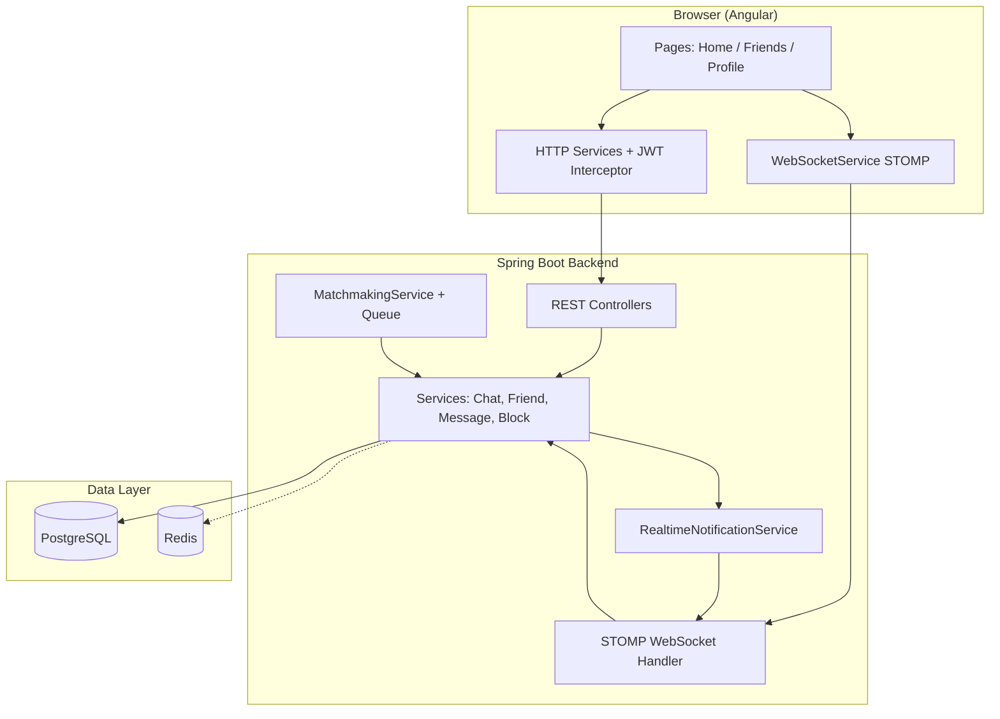

| Layer | Responsibility |
|-------|----------------|
| **Angular UI** | Login, matchmaking UI, chat, friends list, calls |
| **REST API** | Auth, CRUD, matchmaking start/cancel, next partner |
| **WebSocket** | Live messages, typing, friend requests, match-found events |
| **PostgreSQL** | Users, rooms, messages, friendships, blocks |
| **In-memory queue** | Matchmaking wait list (per server instance) |

---

## 2. Application Routes (Frontend)

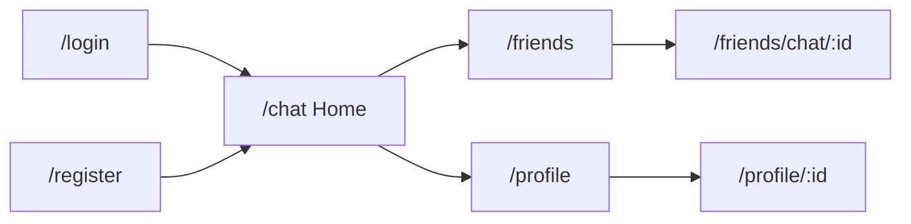

| Route | Component | Purpose |
|-------|-----------|---------|
| `/chat` | Home + random chat | Matchmaking & stranger chat |
| `/friends` | Friends list | Pending requests + friend conversations |
| `/friends/chat/:id` | Friend chat | Persistent chat with a friend |
| `/profile` | Own profile | Edit bio, gender |
| `/profile/:id` | User profile | View / add friend / block |

---

## 3. Authentication Flow

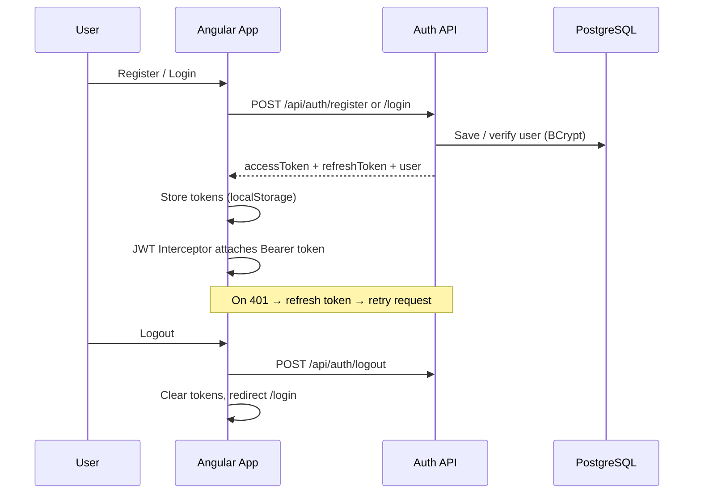

**Security notes**
- Passwords hashed with BCrypt
- JWT in HTTP headers and WebSocket handshake (`?token=` or header)
- Rate limiting per authenticated user (Bucket4j)

---

## 4. Matchmaking Flow

Users pick a **gender preference** (who they want to match with). The queue matches compatible pairs.

**Compatibility rule:** User A matches User B when:
- A's preference = B's gender **AND**
- B's preference = A's gender

**Excluded from match:** blocked users, existing friends.

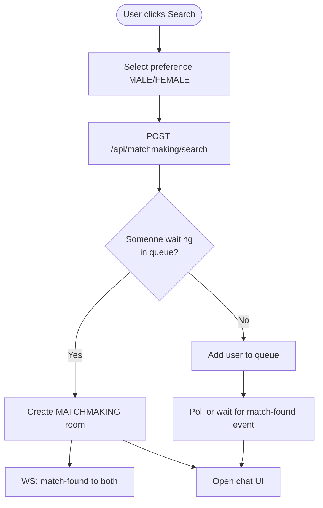

### Example: Suraj, Heena, Ankit

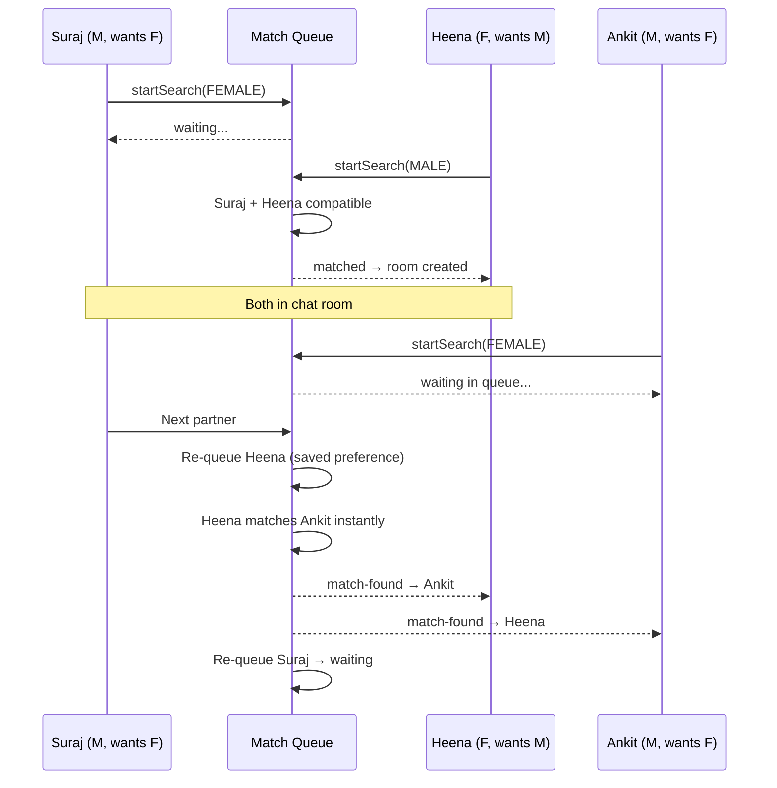

---

## 5. Next Partner Flow

When one user clicks **Next**:

1. Current **MATCHMAKING** room is deactivated
2. **Remaining user** is re-queued with their **last saved preference**
3. If someone is waiting (e.g. Ankit), they **match immediately**
4. Both get **`match-found`** WebSocket event with new room
5. User who clicked Next is also re-queued

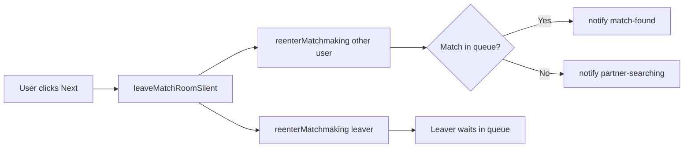

---

## 6. Real-Time Chat Flow

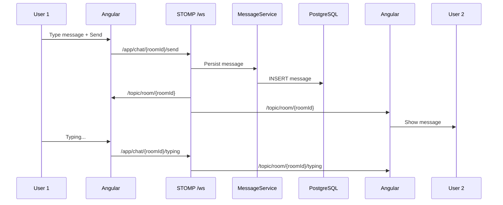

| STOMP destination | Direction | Purpose |
|-------------------|-----------|---------|
| `/topic/room/{roomId}` | Server → clients | New messages |
| `/topic/room/{roomId}/typing` | Server → clients | Typing indicator |
| `/app/chat/{roomId}/send` | Client → server | Send message |
| `/user/queue/friend-requests` | Server → user | Friend request |
| `/user/queue/match-found` | Server → user | New match room |
| `/user/queue/calls` | Server → user | Voice call signaling |

---

## 7. Friends Flow

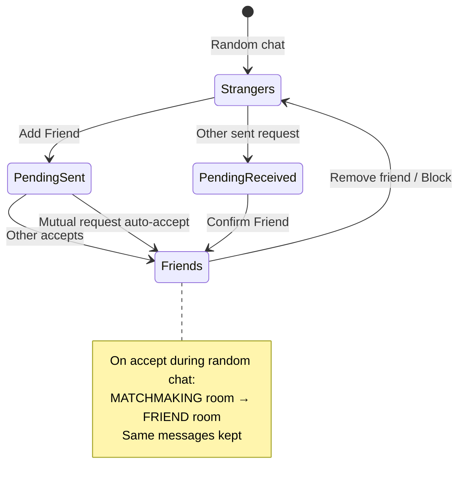

**Steps**
1. **Add Friend** → `POST /api/friends/request/{userId}`
2. Receiver gets WebSocket + banner notification
3. **Confirm** → friendship row + room promoted to `FRIEND` type
4. **Remove friend** → friendship deleted + all chat rooms/messages between pair deleted

---

## 8. Voice Call Flow (WebRTC)

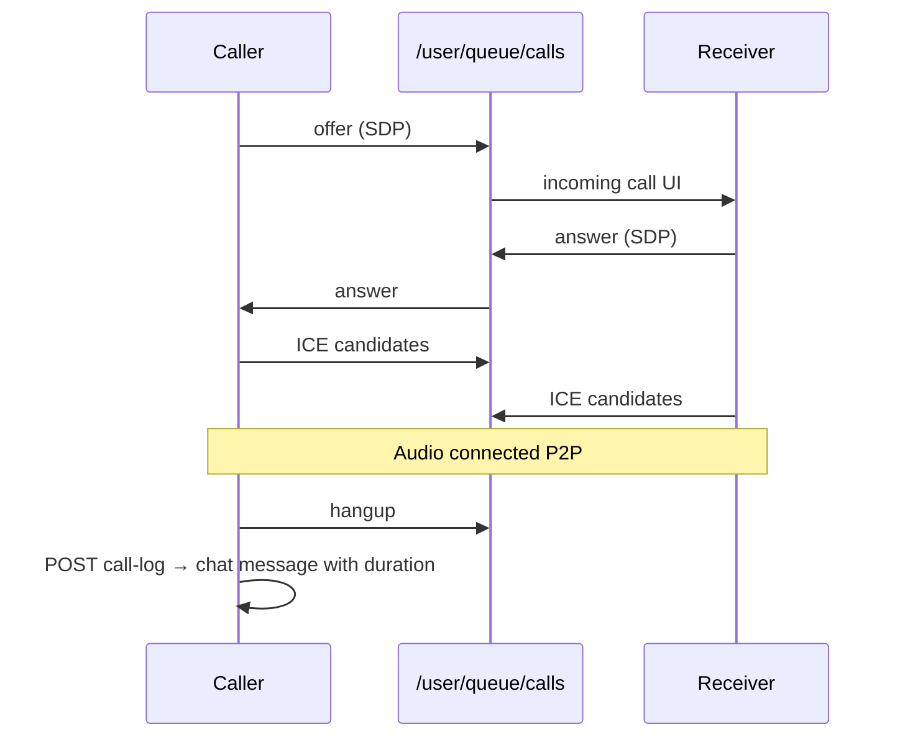

---

## 9. Database Overview

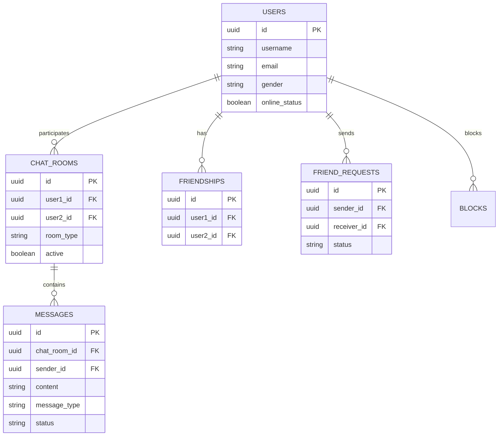

**Room types**
| Type | Use |
|------|-----|
| `MATCHMAKING` | Random stranger chat |
| `FRIEND` | Permanent friend chat (same room can be promoted from match) |

---

## 10. Backend Module Map

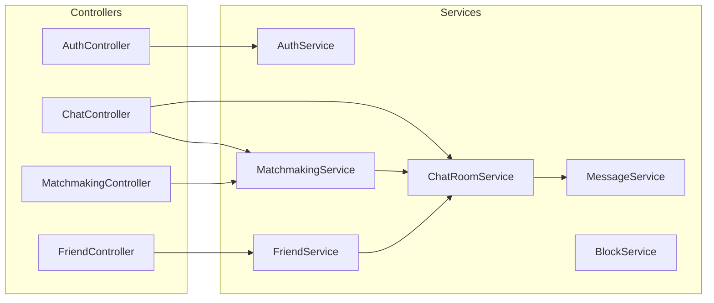

---

## 11. Frontend Services Map

| Service | Role |
|---------|------|
| `AuthService` | Login, register, token storage |
| `WebSocketService` | STOMP connect, room/friend/call subscriptions |
| `ChatApiService` | Rooms, messages, next partner |
| `MatchmakingApiService` | Start / cancel search |
| `FriendApiService` | Friends, requests, overview |
| `FriendNotificationService` | Pending request badges + polling |
| `UnreadCountService` | Unread counts (debounced overview fetch) |
| `CallService` | WebRTC + call UI state |

---

## 12. Deployment Overview

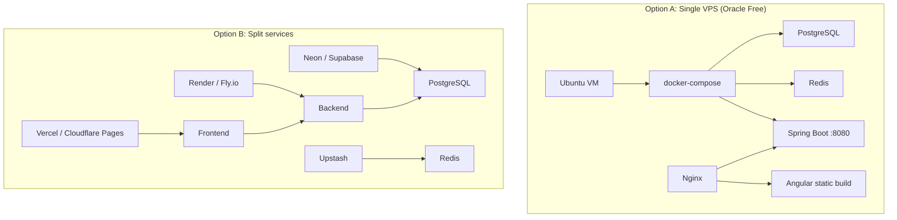

**Production checklist**
- Set strong `JWT_SECRET`
- Set `CORS_ORIGINS` to your frontend URL
- Enable HTTPS (required for WebRTC + secure cookies)
- Configure Nginx WebSocket proxy headers
- Never commit `.env` or database passwords

---

## 13. Local Development Diagram

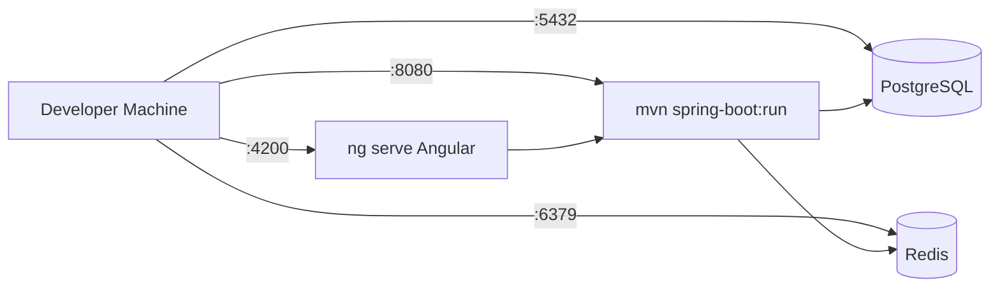

---

## Related Docs

- [API.md](./API.md) — REST endpoint reference
- [README.md](../README.md) — Setup & features
